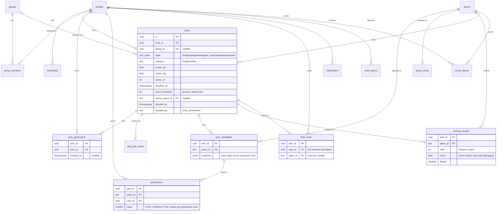
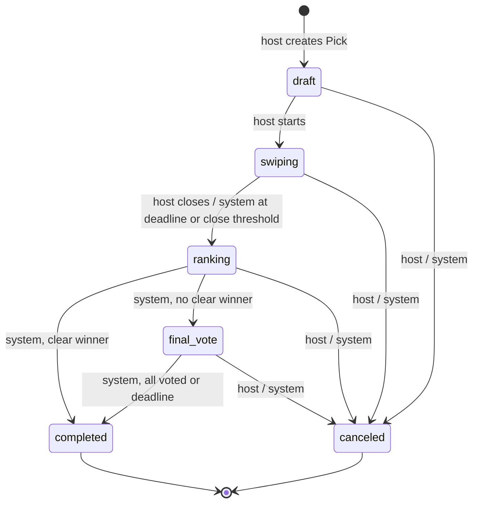

# WTW Design Document (M2)

Sections are owned by the person named in each heading. Fill yours in on your own branch.

## Data model (Alan)

Postgres (Supabase) is the source of truth. Clients read through RLS; **only our API writes** (service role).
Columns below are the ones the decision engine relies on; Razin's migration is authoritative for the rest.



| Table | Purpose |
|---|---|
| `profiles` | One row per account (created on first sign-in). |
| `friendships` | Friend requests, accepted friends, blocks. |
| `groups`, `group_members` | Reusable groups for repeat Picks. |
| `picks` | One decision session: host, category, center + radius, deadline, close threshold, state, and the stored winner (`winner_place_id`, `decided_at`, `decided_by`). |
| `pick_participants` | Who is in a Pick and whether they finished swiping. |
| `pick_join_codes` | 6-character join codes / QR / `wtw://join/CODE` links. |
| `places`, `place_cache` | Normalized provider places; cached provider data (30-day TTL, subject to Google's terms). |
| `pick_candidates` | The fixed, shared pool for one Pick (snapshot, so history does not change when a place does). |
| `preferences` | Each participant's private Yes/Maybe/No per candidate. |
| `ranking_results` | Output of the ranking engine for a Pick. |
| `final_votes` | One ballot per participant among the finalists. |
| `notifications`, `push_tokens` | Invitation and Pick-status notifications. |
| `saved_places` | Ideas saved from Discover. |

## Pick state machine (Alan)

Code: `supabase/functions/_shared/domain/pickState.ts` (`canTransition(from, to, actor)`).
The API is the only writer of `picks.state` and rejects every action that does not belong to the current state
(for example a swipe after ranking, or a vote for a non-finalist).



| From → To | Host | Participant | System |
|---|---|---|---|
| draft → swiping | ✅ | ❌ | ❌ |
| swiping → ranking | ✅ (close manually) | ❌ | ✅ (deadline, or X% finished) |
| ranking → completed | ❌ | ❌ | ✅ (clear winner) |
| ranking → final_vote | ❌ | ❌ | ✅ (no clear winner) |
| final_vote → completed | ❌ | ❌ | ✅ (all voted, or deadline) |
| any unfinished → canceled | ✅ | ❌ | ✅ (e.g. stale Pick sweep) |
| completed / canceled → anything | ❌ | ❌ | ❌ |

"System" means our API acting on its own authority: the `pg_cron` deadline sweep, the close-threshold check after a swipe, and the ranking step itself.
Participants never change the state; they only swipe and vote. Refreshing the candidate pool stays in `swiping` (after swiping has started it asks for confirmation and resets everyone's answers).

## Scoring (Alan)

Code: `supabase/functions/_shared/domain/ranking.ts` (`scoreCandidate`, `rankCandidates`, `clearWinner`); tests in `tests/domain/ranking.test.ts`.
This is a transparent formula, not an AI prediction.

**Per candidate**, with `n` participants and answers Yes = 1, Maybe = 0.5, No = 0, **missing = 0.5 (counts as Maybe)**:

| Term | Definition |
|---|---|
| preference | mean of all `n` values |
| consensus | 1 − (population std-dev of the `n` values ÷ 0.5) |
| coverage | people who actually answered ÷ `n` |
| noProportion | number of No answers ÷ `n` |

```
score = 100 × (0.70·preference + 0.20·consensus + 0.10·coverage) − 15·noProportion,   clamped to 0–100
```

**Worked example: broad enthusiasm with one objection vs. lukewarm agreement**

| Answers (n = 4) | preference | consensus | coverage | noProportion | score |
|---|---|---|---|---|---|
| Yes, Yes, Yes, No | 0.75 | 0.134 | 1 | 0.25 | **61.4** |
| Maybe × 4 | 0.50 | 1.000 | 1 | 0 | **65.0** |

Complete moderate agreement edges out a divisive option: one strong "No" costs both consensus and the −15 penalty.
Other reference points (all locked by tests): all Yes = 100, all No = 15, nobody answered = 55, 3 Maybe + 1 missing = 62.5.

**Ordering ties:** score (desc) → distance from the Pick center (asc, haversine) → place id (asc). The result is deterministic.

**Clear winner:** if only one candidate exists, or #1 beats #2 by **≥ 10 points**, #1 wins and the final vote is skipped.
Otherwise the group votes among the top 3 (or the 1–2 that exist). If #1 is tied, it is never a clear winner; everyone tied for #1 is a finalist, even if that makes more than 3.
Float noise is ignored (differences under 1e-9 count as equal), so an exact 10-point gap always counts.

**Final-vote tie-break:** most votes → higher score → closer to the center → place id.

**What users see:** rank only (1st / 2nd / 3rd, or "Clear winner!"). Scores are stored in `ranking_results.score` for tests and debugging and are never sent to the app.

**Input mapping:** `preferences.value` is 0 = No, 1 = Maybe, 2 = Yes; `answerFromDb` converts it before scoring.

**Open question for the team:** the weights (0.70 / 0.20 / 0.10, −15) are a starting hypothesis. M5 user sessions should tell us whether one "No" is penalized enough.

## Security & privacy (Razin)

Code: `supabase/migrations/0001_init.sql`, `0002_heartbeat_rpcs.sql`; tests in `supabase/tests/rls_test.sql` (`supabase db reset && supabase test db`).

**One writer.** Only the `api` Edge Function writes to Postgres, using the service role on the server. The app gets **no** INSERT / UPDATE / DELETE: no table grants and no write policies. Even a bug in the app, or a user with a modified client, cannot change a Pick, a swipe or a result directly.

**Reads are filtered by RLS on every table.** The app reads as `authenticated` (never `anon`):

| Table | A signed-in user can SELECT |
|---|---|
| `picks`, `pick_participants`, `pick_candidates`, `ranking_results` | rows of Picks they participate in |
| `preferences` | **only their own** answers (nobody sees how others swiped) |
| `profiles` | their own, and people they share a Pick with |
| `places` | places that are candidates in one of their Picks |

Membership checks use `private.*` helpers (security definer, empty `search_path`) in a schema the Data API does not expose.

**Explicit grants.** The hosted project does not auto-expose new tables, and the migration does not rely on defaults either: it revokes everything from `anon` and `authenticated`, then grants `SELECT` to `authenticated` table by table and `ALL` to `service_role`. New tables must add their own RLS policy **and** grant, or the app cannot see them.

**Scores stay on the server.** `ranking_results.score` has no client grant (column-level `SELECT` on `pick_id, place_id, rank, finalist, created_at` only). `select=*` from the app fails with `permission denied`, so a careless query errors instead of leaking. The API also never returns scores. `ranking_results` is intentionally **not** in the Realtime publication, because Realtime would ship whole rows.

**Server-only RPCs.** `heartbeat_*` functions are executable only by `service_role`; they re-check membership, host, state and version inside one locked transaction, so forged user ids or stale requests are rejected (PT403 / PT409).

**Authentication.** Email one-time code (6 digits, 1-hour expiry); no passwords are stored. The API verifies every mutation with `getUser(req)` (`supabase/functions/_shared/auth/getUser.ts`), which asks Supabase Auth to validate the token rather than decoding it, so signed-out or deleted users are rejected. A `profiles` row is created automatically on first sign-in.

**Data we keep.** `profiles` holds a display name and avatar URL only; email lives in Supabase Auth and is never exposed to other users. Preferences are private to their author. Place data is a snapshot per Pick so history does not change later.

**Secrets.** No keys or passwords are committed. The service-role key exists only as an Edge Function secret; the app ships only the public anon/publishable key, which is useless without a user session because `anon` has no table grants.

**Not covered yet:** rate limiting on the API, account deletion flow, join-code brute force protection (M3 with `pick_join_codes`).

## API list v0 (Razin)

Base URL: `<SUPABASE_URL>/functions/v1/api`. Every route except `/health` needs `Authorization: Bearer <user access token>`. Errors are `{ "error": { "code", "message" } }` with 400 / 401 / 403 / 404 / 409 / 500 / 503. Details of the implemented routes: `docs/api-integration.md` (Josh).

**Writes (through the API only)**

| Method & path | Who | What | Status |
|---|---|---|---|
| `GET /health` | anyone | liveness | implemented |
| `POST /picks/:id/swipes` | participant, Pick `swiping` | `{ placeId, value: 0\|1\|2 }` upserts my answer | implemented |
| `POST /picks/:id/rank` | host, Pick `swiping` | close swiping, rank, store results; returns top 3 + decision (no scores) | implemented |
| `POST /picks` | signed-in user | create a Pick (category, center, radius, deadline, close threshold) | planned |
| `POST /picks/:id/candidates` | host, `draft` | fetch and freeze the candidate pool | planned |
| `POST /picks/:id/start` | host, `draft` | `draft → swiping` | planned |
| `POST /picks/join` | signed-in user | join by 6-character code | planned |
| `POST /picks/:id/finish` | participant | mark my swiping finished (drives close threshold) | planned |
| `POST /picks/:id/votes` | participant, `final_vote` | `{ placeId }` for a finalist | planned |
| `POST /picks/:id/cancel` | host | any unfinished state → `canceled` | planned |
| `PATCH /me` | signed-in user | update display name / avatar | planned |

**Database RPCs used by the API** (service role only, `0002_heartbeat_rpcs.sql`)

| Function | Returns / effect |
|---|---|
| `heartbeat_load_pick(p_pick_id, p_user_id)` | `PickSnapshot` json (id, hostId, state, center, participantIds, candidates, preferences, version) or null |
| `heartbeat_upsert_swipe(p_pick_id, p_user_id, p_place_id, p_value)` | upserts one preference, advances version |
| `heartbeat_save_ranking(p_pick_id, p_user_id, p_version, p_ranking)` | `swiping → ranking → completed \| final_vote`, replaces `ranking_results`, sets winner metadata |

**Reads (app → Supabase directly, filtered by RLS)**

| Query | Used for |
|---|---|
| `pick_participants?select=picks(id,state,category,deadline_at)&user_id=eq.<me>` | my Picks |
| `pick_candidates?select=place_id,snapshot&pick_id=eq.<id>` | swipe cards |
| `preferences?select=place_id,value&pick_id=eq.<id>&user_id=eq.<me>` | resume swiping |
| `ranking_results?select=place_id,rank,finalist&pick_id=eq.<id>` | results (never `score`) |
| `picks?select=state,host_id,winner_place_id,decided_by&id=eq.<id>` | outcome / host check |
