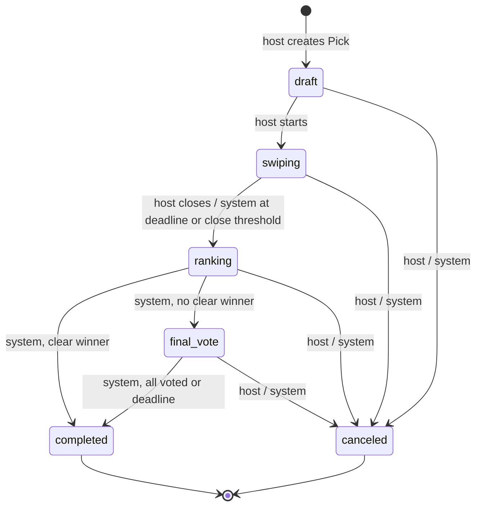

# WTW Design Document (M2)

Sections are owned by the person named in each heading. Fill yours in on your own branch.

## Data model (Alan)

Postgres (Supabase) is the source of truth. Clients read through RLS; **only our API writes** (service role).
Columns below are the ones the decision engine relies on; Razin's migration is authoritative for the rest.


| Table | Purpose |
|---|---|
| `profiles` | One row per account (created on first sign-in). |
| `friendships` | Friend requests, accepted friends, blocks. |
| `groups`, `group_members` | Reusable groups for repeat Picks. |
| `picks` | One decision session: host, category, center + radius, deadline, close threshold, state, and the stored winner (`winner_place_id`, `decided_at`, `decided_by`). |
| `pick_participants` | Who is in a Pick and whether they finished swiping. |
| `pick_join_codes` | 6-character join codes / QR / `wtw://join/CODE` links. |
| `places`, `place_cache` | Normalized provider places; cached provider data (30-day TTL, subject to Google's terms). |
| `pick_candidates` | The fixed, shared pool for one Pick (snapshot, so history does not change when a place does). |
| `preferences` | Each participant's private Yes/Maybe/No per candidate. |
| `ranking_results` | Output of the ranking engine for a Pick. |
| `final_votes` | One ballot per participant among the finalists. |
| `notifications`, `push_tokens` | Invitation and Pick-status notifications. |
| `saved_places` | Ideas saved from Discover. |

## Pick state machine (Alan)

Code: `supabase/functions/_shared/domain/pickState.ts` (`canTransition(from, to, actor)`).
The API is the only writer of `picks.state` and rejects every action that does not belong to the current state
(for example a swipe after ranking, or a vote for a non-finalist).



| From → To | Host | Participant | System |
|---|---|---|---|
| draft → swiping | ✅ | ❌ | ❌ |
| swiping → ranking | ✅ (close manually) | ❌ | ✅ (deadline, or X% finished) |
| ranking → completed | ❌ | ❌ | ✅ (clear winner) |
| ranking → final_vote | ❌ | ❌ | ✅ (no clear winner) |
| final_vote → completed | ❌ | ❌ | ✅ (all voted, or deadline) |
| any unfinished → canceled | ✅ | ❌ | ✅ (e.g. stale Pick sweep) |
| completed / canceled → anything | ❌ | ❌ | ❌ |

"System" means our API acting on its own authority: the `pg_cron` deadline sweep, the close-threshold check after a swipe, and the ranking step itself.
Participants never change the state; they only swipe and vote. Refreshing the candidate pool stays in `swiping` (after swiping has started it asks for confirmation and resets everyone's answers).

## Scoring (Alan)

Code: `supabase/functions/_shared/domain/ranking.ts` (`scoreCandidate`, `rankCandidates`, `clearWinner`); tests in `tests/domain/ranking.test.ts`.
This is a transparent formula, not an AI prediction.

**Per candidate**, with `n` participants and answers Yes = 1, Maybe = 0.5, No = 0, **missing = 0.5 (counts as Maybe)**:

| Term | Definition |
|---|---|
| preference | mean of all `n` values |
| consensus | 1 − (population std-dev of the `n` values ÷ 0.5) |
| coverage | people who actually answered ÷ `n` |
| noProportion | number of No answers ÷ `n` |

```
score = 100 × (0.70·preference + 0.20·consensus + 0.10·coverage) − 15·noProportion,   clamped to 0–100
```

**Worked example: broad enthusiasm with one objection vs. lukewarm agreement**

| Answers (n = 4) | preference | consensus | coverage | noProportion | score |
|---|---|---|---|---|---|
| Yes, Yes, Yes, No | 0.75 | 0.134 | 1 | 0.25 | **61.4** |
| Maybe × 4 | 0.50 | 1.000 | 1 | 0 | **65.0** |

Complete moderate agreement edges out a divisive option: one strong "No" costs both consensus and the −15 penalty.
Other reference points (all locked by tests): all Yes = 100, all No = 15, nobody answered = 55, 3 Maybe + 1 missing = 62.5.

**Ordering ties:** score (desc) → distance from the Pick center (asc, haversine) → place id (asc). The result is deterministic.

**Clear winner:** if only one candidate exists, or #1 beats #2 by **≥ 10 points**, #1 wins and the final vote is skipped.
Otherwise the group votes among the top 3 (or the 1–2 that exist). If #1 is tied, it is never a clear winner; everyone tied for #1 is a finalist, even if that makes more than 3.
Float noise is ignored (differences under 1e-9 count as equal), so an exact 10-point gap always counts.

**Final-vote tie-break:** most votes → higher score → closer to the center → place id.

**What users see:** rank only (1st / 2nd / 3rd, or "Clear winner!"). Scores are stored in `ranking_results.score` for tests and debugging and are never sent to the app.

**Input mapping:** `preferences.value` is 0 = No, 1 = Maybe, 2 = Yes; `answerFromDb` converts it before scoring.

**Open question for the team:** the weights (0.70 / 0.20 / 0.10, −15) are a starting hypothesis. M5 user sessions should tell us whether one "No" is penalized enough.

## What changed since M1 (Mike)

| Topic | In M1 | Decision now |
|---|---|---|
| Platform | The proposal said web app; the M1 slides said native apps. | **Native, via Expo + React Native** (one TypeScript codebase for iOS and Android). |
| Group location | A "fair radius for the group" computed from everyone's location. | **The host picks the center and radius** when creating the Pick (`picks.center_lat`, `center_lng`, `radius_m`). |
| Guests | Guests could take part. | **An account is required** to join a Pick. |
| Score | Users see a WTW Match Score. | **Users see rank only** (1st / 2nd / 3rd, or "Clear winner!"). Scores stay server-side; see [Scoring](#scoring-alan). |

## UI flow (Mike)

The four M2 screens, in order. Every screen also runs without a backend in mock mode
(`EXPO_PUBLIC_USE_MOCK=1`, local fixture of 20 places; sign-in code `123456`).

1. **Sign in**: enter email, then the 6-digit code from the email (`signInWithOtp`, then `verifyOtp` with type `email`). Wrong or expired codes show an error; "Resend code" unlocks after 60 s.

   

2. **Home**: the Picks I'm a participant in. Tapping a Pick opens Swipe (while swiping) or Results (after ranking).

   

3. **Swipe**: one card at a time (photo, name, price level, rating) with Yes / Maybe / No buttons or a swipe (right = Yes, left = No, up = Maybe). Shows progress ("7 / 20"), resumes at my first unanswered card, saves each answer optimistically and offers Retry if a save fails. "Rank" appears once every answer is saved.

   

4. **Results**: calls the API to rank, then shows rank only: 1st / 2nd / 3rd with name and photo, or "Clear winner!" with one place. No scores anywhere.

   

## Requirement → component map (Mike)

M2 implements FR-01 (sign-in part), FR-09, FR-10, FR-11 and FR-13. Everything else is planned for M3 or later.
Owners follow the README ownership table; owners, please correct your rows.

| FR | Requirement | Screen | API route | Table(s) | Owner | Milestone |
|---|---|---|---|---|---|---|
| FR-01 | Create an account, sign in, sign out, and maintain a profile. | Sign in; sign out on Home. Profile: planned | None (Supabase Auth `signInWithOtp` / `verifyOtp`) | `profiles` | Razin (auth), Mike (screens) | M2 (sign-in); profile M3+ |
| FR-02 | Complete and later edit a short preference profile. | planned | planned | `profiles` | Razin | M3+ |
| FR-03 | Send, accept, remove, and block friend relationships. | planned | planned | `friendships` | Razin | M3+ |
| FR-04 | Create, name, and manage a reusable group. | planned | planned | `groups`, `group_members` | Razin | M3+ |
| FR-05 | Create a Pick for selected friends or a saved group. | planned | planned | `picks`, `pick_participants` | Alan | M3+ |
| FR-06 | Select Food or Activities and optionally refine location, radius, price, and open status. | planned | planned | `picks` | Josh | M3+ |
| FR-07 | Retrieve and normalize a bounded nearby candidate pool. | planned | planned | `places`, `place_cache`, `pick_candidates` | Josh | M3+ |
| FR-08 | Join an authorized Pick through the app or invitation link. | planned | planned | `pick_join_codes`, `pick_participants` | Razin | M3+ |
| FR-09 | Record exactly one Yes, Maybe, or No response per candidate and revise it before closure. | Swipe (buttons, gesture, Back to revise) | `POST /picks/:id/swipes` | `preferences`, `pick_candidates` | Alan (responses), Mike (screen) | M2 |
| FR-10 | Persist responses and restore progress after refresh or reconnection. | Swipe (resumes at first unanswered card) | `POST /picks/:id/swipes`; own answers read through RLS | `preferences` | Mike | M2 |
| FR-11 | Hide individual responses until aggregation is complete. | Swipe, Results (no one else's answers shown) | None (RLS: participants read only their own `preferences`) | `preferences` | Razin (RLS) | M2 |
| FR-12 | Close responses after all participants finish or according to a documented timeout rule. | planned | planned | `picks`, `pick_participants` | Alan | M3+ |
| FR-13 | Calculate deterministic group scores and return the top three candidates. | Results (rank only) | `POST /picks/:id/rank` | `ranking_results`, `picks` | Alan | M2 |
| FR-14 | Provide a plain-language explanation for each top result. **Revised: rank + plain-language reason, no number** (conflicts with the rank-only decision). | planned | planned | `ranking_results` | Alan | M3+ |
| FR-15 | Vote once among the three finalists. | planned | planned | `final_votes` | Mike | M3+ |
| FR-16 | Resolve ties, declare one winner, and save the outcome. | planned | planned | `picks`, `final_votes` | Alan | M3+ |
| FR-17 | Browse a bounded individual Discover feed and save interests. | planned | planned | `places`, `saved_places` | Josh | M3+ |
| FR-18 | View completed Pick history for groups they belong to. | planned | planned | `picks`, `groups`, `group_members` | Razin | M3+ |
